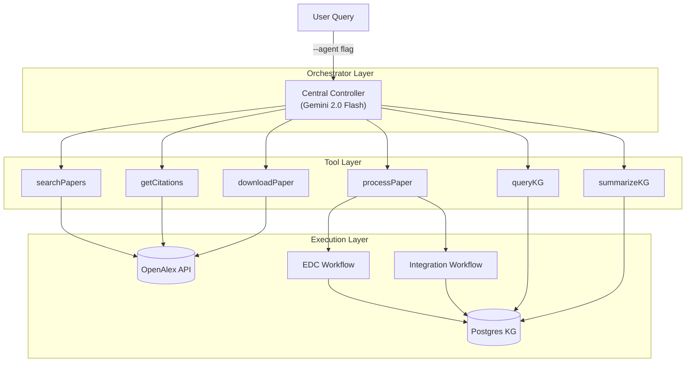

# Agentic Implementation

This system implements a Central Controller using ReACT (Reason + Act) reasoning for autonomous knowledge graph construction.

## Architecture

The `KnowledgeGraphBuilder` is a Gemini 2.0 Flash agent that autonomously discovers and processes papers.

## ReACT Loop

1. **Thought**: Analyze current task and graph state
2. **Action**: Select and invoke a tool
3. **Observation**: Process tool output
4. **Repeat**: Continue until goal achieved

## Tool Ecosystem

### Discovery Tools
- **`searchPapers(query, limit)`**: OpenAlex search by relevance
- **`getCitations(paperId, limit)`**: Find citing papers (citation crawling)
- **`downloadPaper(metadata)`**: PDF retrieval with arXiv fallback

### Processing Tool
- **`processPaper(path)`**: Wraps EDC + Integration workflows, returns structured stats
  - See [03-extraction-pipeline.md](./03-extraction-pipeline.md) for EDC details
  - See [04-integration-pipeline.md](./04-integration-pipeline.md) for integration details

### Analysis Tools
- **`queryKnowledgeGraph(term)`**: Check if concept exists in graph
- **`summarizeKnowledgeGraph()`**: High-level metrics (entity count, top types)

## System Prompt Strategy

The agent is instructed to:
- Start with a seed paper or broad search
- Prioritize highly-cited papers
- Expand via citation crawling
- Periodically check graph stats
- Stop when target paper count reached

