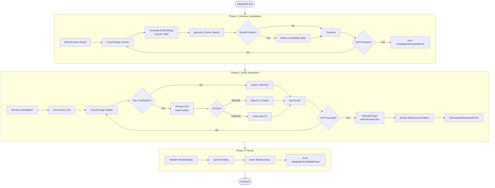

# Integration Pipeline

Merges newly extracted knowledge with the existing graph using semantic similarity and LLM-based entity resolution. Inspired by KARMA's Conflict Resolution and Evaluator agents (https://arxiv.org/pdf/2502.06472).

Runs after [03-extraction-pipeline.md](./03-extraction-pipeline.md) to merge graphs across papers.

See [07-design-rationale.md](./07-design-rationale.md) for design decisions.

## Workflow Phases

1. **Retrieve Candidates**: Vector similarity search for potential duplicates
2. **Entity Resolution**: LLM decides MERGE vs CREATE
3. **Persist**: Save resolved graph with valid relationships

## Workflow Diagram

## Phase Details

### Retrieve Candidates
For each new entity:
- Generate 768d embedding using Gemini
- Query `entities` table using pgvector cosine distance (`< threshold`)
- Build `Map<entityId, candidateEntities[]>`

See [05-sql-schema.md](./05-sql-schema.md) for `entities` table structure and vector indexing.

### Entity Resolution (KARMA-inspired)
**Conflict Resolution Agent (CRA)**: Semantic similarity identifies candidates  
**Evaluator Agent (EA)**: LLM makes merge decisions

For each entity:
- **No candidates**: Automatically CREATE
- **Has candidates**: Ask LLM: "Is this new entity the same as any existing candidates?"
  - **MERGE**: Map new ID → existing ID
  - **CREATE**: Keep as distinct entity

**Graph Rebuilding**:
- Filter out merged entities
- Update all relationships to use resolved IDs
- Track `referencedEntityIds` (merge targets not in current graph) to prevent orphan relationships

### Persist
- Validate relationships against `entities` + `referencedEntityIds`
- Upsert entities (idempotent)
- Insert relationships with `sourcePaperId` for provenance

## Why This Matters

Integration is what transforms a collection of document-level graphs into a unified knowledge graph. Without it, entities would duplicate across papers and relationships would be isolated.

KARMA demonstrated that multi-stage conflict resolution significantly improves KG quality - this implementation validates that approach.

See [08-limitations-tradeoffs.md](./08-limitations-tradeoffs.md) for why LLM-based resolution was chosen over rule-based.
