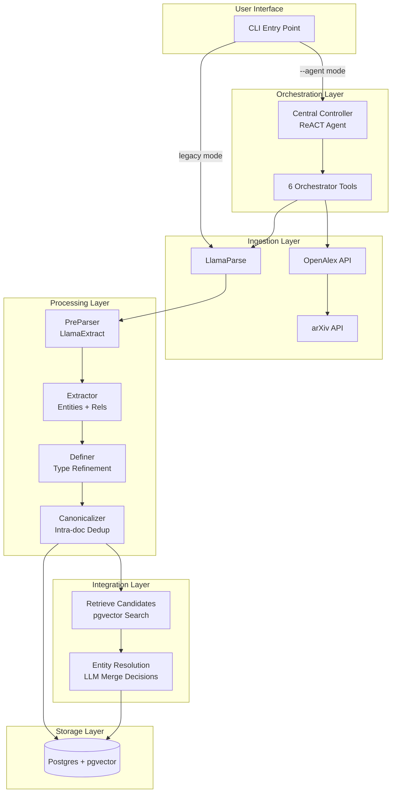

# System Architecture

High-level overview of the knowledge graph construction system.

## Overall Flow

```
User Query → Central Controller → Tools → EDC Pipeline → Integration → Postgres KG
```

## Component Architecture



## Execution Modes

See [01-backend-overview.md](./01-backend-overview.md) for quick start commands.

### Agentic Mode
Central Controller autonomously:
1. Searches for papers (OpenAlex)
2. Downloads PDFs  
3. Processes each through EDC + Integration
4. Queries graph to avoid redundancy
5. Reports final statistics

### Legacy Mode
Direct pipeline execution:

See [02-agent-implementation.md](./02-agent-implementation.md) for agentic mode details.
1. Load PDF
2. Run EDC workflow
3. Optionally run Integration workflow

## Data Flow

**Single Paper Processing**:
```
PDF → Markdown Text → Paper Context (metadata) → 
Entities + Relationships → Type Refinement → 
Intra-doc Dedup → Similarity Search → 
LLM Merge Decisions → Postgres
```

**Artifacts**:
- `debug/00_preparsed.json`
- `debug/01_extraction.json`
- `debug/02_definition.json`
- `debug/03_canonicalization.json`

See [03-extraction-pipeline.md](./03-extraction-pipeline.md) for stage-by-stage details.

## Technology Integration

**LlamaIndex** provides:
- Workflow orchestration (`@llamaindex/workflow-core`)
- Agent framework (ReACT)
- Tool definitions

**Gemini 2.0 Flash** powers:
- Entity extraction
- Type refinement
- Entity resolution
- Agent reasoning

**pgvector** enables:
- Semantic entity similarity (768d embeddings)
- Fast HNSW indexing

**Drizzle ORM** provides:
- Type-safe queries
- Schema migrations
- Supabase integration

## Storage Architecture

**Single Persistent Store**: No separate ephemeral vector store. All embeddings stored in `entities.embedding` column.

**Provenance**: All relationships track `sourcePaperId` for traceability back to source paper.

**Idempotency**: Entities use deterministic IDs, allowing safe re-processing.

See [05-sql-schema.md](./05-sql-schema.md) for complete schema definition.
