# EDC Pipeline Workflow Documentation

> **Agentic Context**: This workflow is now wrapped by the `processPaper` tool in the agentic architecture. The agent invokes this entire pipeline as a single atomic action.

This document outlines the Extraction-Definition-Canonicalization (EDC) pipeline, which transforms raw scientific papers into structured Knowledge Graphs.

## Workflow Overview

The pipeline executes a sequential series of transformations:
1.  **Load**: Ingests the raw PDF document.
2.  **Pre-Parse**: Extracts structured metadata (title, authors, abstract) using LlamaExtract.
3.  **Extract**: Identifies initial entities and relationships using an LLM with pre-parsed context.
4.  **Define**: Refines entity types and definitions.
5.  **Canonicalize**: Resolves duplicates *within* the single document scope.
6.  **Save**: Persists the structured graph to the database.

## Mermaid Graph

```mermaid
graph TD
    %% Events
    EventStart([loadEvent]) --> Step1
    
    %% Step 1: Load
    subgraph Step1 [Step 1: Load]
        direction TB
        S1_Start[Receive Paper Path] --> S1_Loader[LlamaParseLoader]
        S1_Loader --> S1_Load[Load & Parse Text]
        S1_Load --> S1_Emit[Emit preParsedEvent]
    end

    %% Transitions
    Step1 -->|preParsedEvent| Step1b
    Step1 -.->|Error| ErrorHandler

    %% Step 1b: Pre-Parse
    subgraph Step1b [Step 1b: Pre-Parse]
        direction TB
        S1b_Start[Receive Text] --> S1b_PreParser[PreParser Process]
        S1b_PreParser --> S1b_Extract[Extract Metadata via LlamaExtract]
        S1b_Extract --> S1b_Context[Generate PaperContext]
        S1b_Context --> S1b_Debug[Save 00_preparsed.json]
        S1b_Debug --> S1b_Emit[Emit extractEvent]
    end

    %% Transitions
    Step1b -->|extractEvent| Step2
    Step1b -.->|Error| ErrorHandler

    %% Step 2: Extract
    subgraph Step2 [Step 2: Extract]
        direction TB
        S2_Start[Receive Text + Context] --> S2_Extractor[Extractor Process]
        S2_Extractor --> S2_LLM[LLM Extraction with Context]
        S2_LLM --> S2_RawGraph[Generate Raw Graph]
        S2_RawGraph --> S2_Debug[Save 01_extraction.json]
        S2_Debug --> S2_Emit[Emit defineEvent]
    end

    %% Transitions
    Step2 -->|defineEvent| Step3
    Step2 -.->|Error| ErrorHandler

    %% Step 3: Define
    subgraph Step3 [Step 3: Define]
        direction TB
        S3_Start[Receive Raw Graph] --> S3_Definer[Definer Process]
        S3_Definer --> S3_Refine[Refine Types & Definitions]
        S3_Refine --> S3_RefinedGraph[Generate Refined Graph]
        S3_RefinedGraph --> S3_Debug[Save 02_definition.json]
        S3_Debug --> S3_Emit[Emit canonicalizeEvent]
    end

    %% Transitions
    Step3 -->|canonicalizeEvent| Step4
    Step3 -.->|Error| ErrorHandler

    %% Step 4: Canonicalize
    subgraph Step4 [Step 4: Canonicalize]
        direction TB
        S4_Start[Receive Refined Graph] --> S4_Canon[Canonicalizer Process]
        S4_Canon --> S4_Dedup[Intra-document Deduplication]
        S4_Dedup --> S4_FinalGraph[Generate Final Graph]
        S4_FinalGraph --> S4_Debug[Save 03_canonicalization.json]
        S4_Debug --> S4_Emit[Emit saveEvent]
    end

    %% Transitions
    Step4 -->|saveEvent| Step5
    Step4 -.->|Error| ErrorHandler

    %% Step 5: Save
    subgraph Step5 [Step 5: Persist]
        direction TB
        S5_Start[Receive Final Graph] --> S5_Store[DrizzleGraphStore]
        S5_Store --> S5_Save[Save to DB]
        S5_Save --> S5_Emit[Emit completeEvent]
    end

    %% Transitions
    Step5 -->|completeEvent| EndSuccess([End: Success])
    Step5 -.->|Error| ErrorHandler

    %% Error Handling
    subgraph ErrorHandler [Error Handling]
        Err_Log[Log Error details] --> Err_Emit[Emit completeEvent]
    end
    
    Err_Emit --> EndFail([End: Failed])

    %% Styling
    style Step1 fill:#e3f2fd,stroke:#1565c0,stroke-width:2px
    style Step1b fill:#e1f5fe,stroke:#0277bd,stroke-width:2px
    style Step2 fill:#f3e5f5,stroke:#7b1fa2,stroke-width:2px
    style Step3 fill:#fff3e0,stroke:#ef6c00,stroke-width:2px
    style Step4 fill:#e0f2f1,stroke:#00695c,stroke-width:2px
    style Step5 fill:#f1f8e9,stroke:#558b2f,stroke-width:2px
    style ErrorHandler fill:#ffebee,stroke:#b71c1c,stroke-width:2px
```

## Detailed Steps

### 1. Load (Data Ingestion)
*   **Input**: `paperPath` (string)
*   **Logic**: Uses `LlamaParseLoader` to parse the PDF at the given path into a text string.
*   **Output**: Raw text content of the paper.

### 1b. Pre-Parse (Metadata Extraction)
*   **Input**: Raw text
*   **Logic**: Uses the `PreParser` module (backed by LlamaExtract) to extract structured metadata from the paper, including title, authors, abstract, and key concepts.
*   **Output**: A `PaperContext` object with structured metadata.
*   **Artifacts**: Saves `debug/00_preparsed.json`.
*   **Purpose**: Provides context to improve entity extraction accuracy in the next stage.

### 2. Extract (Entities & Relationships)
*   **Input**: Raw text + `PaperContext` (from pre-parse)
*   **Logic**: uses the `Extractor` module (backed by an LLM) to identify scientific entities (Chemicals, Proteins, etc.) and relationships (Interactions, Pathways) from the unstructured text, leveraging the pre-parsed context for better accuracy.
*   **Output**: A raw `GraphData` object containing entities and relationships.
*   **Artifacts**: Saves `debug/01_extraction.json`.

### 3. Define (Refinement)
*   **Input**: Raw `GraphData`
*   **Logic**: Uses the `Definer` module to clean up entity types and ensure definitions are consistent and accurate.
*   **Output**: A refined `GraphData` object.
*   **Artifacts**: Saves `debug/02_definition.json`.

### 4. Canonicalize (Intra-Document Resolution)
*   **Input**: Refined `GraphData`
*   **Logic**: Uses the `Canonicalizer` module to resolve duplicate entities *within the same document* (e.g., merging "Caffeine" and "1,3,7-Trimethylxanthine" if they refer to the same concept in this paper). This is distinct from the Integration phase, which resolves across the entire database.
*   **Output**: A canonicalized `GraphData` object (Final Graph).
*   **Artifacts**: Saves `debug/03_canonicalization.json`.

### 5. Save (Persistence)
*   **Input**: Final `GraphData`
*   **Logic**: Uses `DrizzleGraphStore` to upsert the graph into the database. Note: It purposefully keeps the connection open if this is part of a larger chain, or closes it if standalone.
*   **Output**: Emits `completeEvent` with statistics (count of entities/relationships saved).
