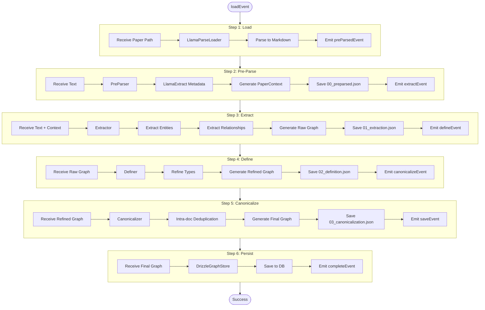

# Extraction Pipeline (EDC Workflow)

The EDC (Extract → Define → Canonicalize) pipeline transforms raw PDFs into structured knowledge graphs. Inspired by https://arxiv.org/pdf/2404.03868.

See [07-design-rationale.md](./07-design-rationale.md) for why this pattern was chosen.

## Pipeline Stages

1. **Load**: Parse PDF to markdown text (LlamaParse)
2. **Pre-Parse**: Extract structured metadata (LlamaExtract) - *inspired by KARMA*
3. **Extract**: Identify entities and relationships (LLM)
4. **Define**: Refine types and definitions (LLM)
5. **Canonicalize**: Deduplicate within document
6. **Save**: Persist to database

## Workflow Diagram

## Stage Details

### Pre-Parse (optional - KARMA-inspired)
Extracts structured metadata before entity extraction to focus the model:
- Title, authors, abstract
- Publication venue, year
- Key contributions

Saves `debug/00_preparsed.json`. Context passed to Extractor as `PaperContext`.

### Extract (KARMA-inspired two-stage pattern)
- **Stage 1**: Entity Extraction - Identify entities FIRST
- **Stage 2**: Relationship Extraction - Extract relationships between identified entities

This separation reduces hallucinations and improves accuracy.

### Define
Type refinement and definition consistency using LLM.

### Canonicalize
Resolves duplicates *within* the single document scope (e.g., merging "Caffeine" and "1,3,7-Trimethylxanthine" if they refer to the same concept).

Integration workflow handles *cross-document* deduplication. See [04-integration-pipeline.md](./04-integration-pipeline.md).

## Debug Artifacts

All intermediate outputs saved to `debug/` for inspection:

(Referenced in [02-agent-implementation.md](./02-agent-implementation.md) for agent observability)
- `00_preparsed.json` - Structured metadata
- `01_extraction.json` - Raw entities/relationships
- `02_definition.json` - Refined types
- `03_canonicalization.json` - Final graph before integration
